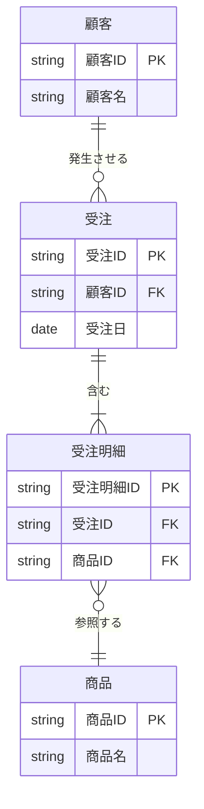

# 概念データモデル作成スキル

業務要件・仕様書・業務フロー等のドキュメントから、概念データモデルを体系的に作成するための手順とガイドラインを定義する。

---

## 最終成果物の形式（必須）

**最終成果物は単一の Markdown ファイル（`.md`）として出力する。**

- ER図は **Mermaid の `erDiagram`** で記述する
- 定義表・一覧表はすべて **Markdownテーブル** で記述する
- ファイル名例：`conceptual-data-model.md`

### Mermaid erDiagram の記法ルール



### カーディナリティ記号一覧

| 記号 | 意味 |
|------|------|
| `\|\|` | 必須・1 |
| `o\|` | 任意・1 |
| `\|\{` | 必須・多 |
| `o{` | 任意・多 |

### サブジェクトエリアの表現
Mermaid `erDiagram` はサブジェクトエリアのグループ化に対応していないため、**コメント（`%%`）でエリア境界を明示**する。

```
%% === 販売管理エリア ===
%% === 在庫管理エリア ===
```

### 連携エンティティの表現
外部連携エンティティはエンティティ名の末尾に `<<IF>>` を付与して区別する。

```
顧客情報取込ファイル<<IF>> {
    string 顧客ID FK
}
```

---

## 全体の流れ

```
Step 1: リソース系エンティティの抽出と定義
Step 2: イベント系エンティティの抽出と定義
Step 3: サブジェクトエリアへの分割
Step 4: リレーションシップの定義
Step 5: データ連携の把握
Step 6: データ連携ファイルのエンティティ登録
Step 7: 用語集作成の開始
```

成果物は **Mermaid ER図（`erDiagram`）＋各種定義表** を1つのMarkdownにまとめる。図式のみ・定義のみは不完全とみなす。

---

## Step 1: リソース系エンティティの抽出と定義

### 目的
業務の管理対象となる「モノ・ヒト・場所・概念」を特定し、定義する。

### インプット
- ビジネス／業務の鳥観図
- 業務ルール・業務規定
- 要求仕様書
- 新システム全体図

### 作業手順

1. **名詞の洗い出し**
   - 上記ドキュメントからビジネス上の「名詞」をすべて書き出す
   - 例：顧客、商品、契約、部署、拠点、口座

2. **エンティティ候補の絞り込み**
   - 管理対象として意味を持つものを選別する
   - 属性（色・金額など値のみのもの）はエンティティではなくアトリビュートとして扱う

3. **エンティティ定義の記述**
   各エンティティについて以下を定義する：

   | 項目 | 内容 |
   |------|------|
   | エンティティ名 | 業務用語で統一した名称 |
   | 何のために存在するか | 業務上の目的・役割 |
   | 誰が管理するか | 担当部署・システム |
   | 制約・取り決め | ビジネスルール・制約条件 |

4. **管理方針の決定**（必須）
   各リソース系エンティティについて以下のいずれかを明示する：
   - **既存システムのマスターを使用**
   - **外部システムと連携して参照**
   - **新規に独自作成**

   > ⚠️ この方針が後から変わると概念データモデリングの再作業が必要になる。必ず早期に確定すること。

### 出力形式（エンティティ一覧表）

```
| エンティティ名 | 定義（何のために存在するか） | 管理者 | 管理方針 | 備考 |
|----------------|------------------------------|--------|----------|------|
| 顧客           | 商品・サービスを購入する個人または法人 | 営業部 | 既存CRMより参照 | |
| 商品           | 販売対象となる製品またはサービス | 商品部 | 新規作成 | |
```

---

## Step 2: イベント系エンティティの抽出と定義

### 目的
業務上の「出来事・行為・取引」を表すエンティティを特定し、定義する。

### イベント系エンティティの特徴
- 伝票処理が発生する行為が候補
- 例：**予約、受注、発注、入金、出荷、契約締結、申請**
- 時系列で発生し、発生した事実を記録するデータ

### 作業手順

1. **業務フロー図からイベントを抽出**
   - ToBe概要業務フロー・詳細業務フローに記載されたデータアイコンを参照
   - 「〜する」「〜が発生する」という動詞に着目して名詞化する

2. **エンティティ定義の記述**（Step 1 と同様の定義項目で実施）

3. **リソース系との紐付けを確認**
   - どのリソース系エンティティと関連するかをメモする

### 出力形式（イベント系エンティティ一覧表）

```
| エンティティ名 | 定義 | 発生タイミング | 関連リソース | 備考 |
|----------------|------|----------------|--------------|------|
| 受注           | 顧客から商品の注文を受け付けた事実 | 顧客の注文確定時 | 顧客、商品 | |
| 出荷           | 倉庫から商品を発送した事実 | 倉庫担当者の出荷操作時 | 商品、倉庫 | |
```

---

## Step 3: サブジェクトエリアへの分割

### 目的
全体のエンティティを業務上のまとまりでグループ化し、モデルを整理・可読化する。

### 作業手順

1. **グルーピングの基準を決める**
   - 業務上の結びつきが強いエンティティ同士をグループ化
   - 例：「販売系」「仕入れ系」「在庫系」「顧客管理系」

2. **サブジェクトエリア一覧表の作成**

```
| サブジェクトエリア名 | 含まれるエンティティ | 説明 |
|----------------------|----------------------|------|
| 販売管理             | 顧客、受注、受注明細、請求 | 顧客への販売プロセスに関するデータ |
| 在庫管理             | 商品、倉庫、在庫、入出庫 | 商品の在庫管理に関するデータ |
```

3. **Mermaid図上でのエリア表現**
   - Mermaid の `erDiagram` はグループ化非対応のため、`%% === エリア名 ===` コメントでエリア境界を明示する
   - エリア間をまたぐリレーションシップは明示的に記述する

---

## Step 4: リレーションシップの定義

### 目的
エンティティ間の関係性を「動詞」で定義し、ER図に線を引く。

### 作業手順

1. **動詞の収集**
   - Step 1・2で収集した名詞をつなぐ「動詞」を文書から収集する
   - 例：顧客が**注文する**→受注、受注が**含む**→商品

2. **リレーションシップ定義の記述形式**
   ```
   【矢印元エンティティ】は【矢印先エンティティ】を〜する
   ```
   - 例：「顧客は受注を発生させる」
   - 例：「受注は商品を含む」
   - 例：「商品は在庫を構成させる」

3. **カーディナリティの定義**
   - 1対1（1:1）
   - 1対多（1:N）
   - 多対多（M:N）→ 中間エンティティを検討する

4. **リレーションシップ定義表の作成**

```
| リレーション名 | 矢印元エンティティ | 矢印先エンティティ | 定義文 | カーディナリティ |
|----------------|--------------------|--------------------|--------|-----------------|
| 発生させる     | 顧客               | 受注               | 顧客は受注を発生させる | 1:N |
| 含む           | 受注               | 受注明細           | 受注は受注明細を含む | 1:N |
```

> ⚠️ すべての線には「引かれた理由」が必要。理由を説明できないリレーションシップは削除または再検討する。

---

## Step 5: データ連携の把握

### 目的
外部システムとのデータのやり取りを整理し、モデルに反映する準備をする。

### 作業手順

1. **データ連携の洗い出し**
   - システム全体図の外部インターフェース記述を参照
   - API連携・ファイル連携・DB連携など種別を問わず列挙する

2. **データ連携一覧表の作成**

```
| 連携名          | 方向         | 連携形式    | 相手システム | 連携項目（概要） | 頻度 |
|-----------------|--------------|-------------|--------------|------------------|------|
| 顧客情報取込    | 外部→本システム | CSVファイル | 基幹CRM      | 顧客ID、名称、住所 | 日次 |
| 在庫情報連携    | 本システム→外部 | API(REST)   | 倉庫管理WMS  | 商品コード、在庫数 | リアルタイム |
```

3. **ラフデザインの作成**（可能であれば）
   - 連携の方向を矢印で示した簡易図を作成する

---

## Step 6: データ連携ファイルのエンティティ登録

### 目的
データ連携用ファイル・APIをエンティティとして概念データモデルに登録し、CRUDマトリクスで管理可能にする。

### 原則
> **存在するデータの塊りは、それが何であろうと、エンティティとして管理する。**

### 対象
- すべての外部インターフェース（ファイル連携）
- すべてのAPI（受信・送信）

### 作業手順

1. **連携エンティティ一覧への追加**
   - Step 5 の連携一覧を参照し、各連携ファイル・APIをエンティティとして登録する

2. **定義の記述**（他のエンティティと同様）
   ```
   | エンティティ名        | 定義 | 連携先 | 連携方向 | 形式 |
   |----------------------|------|--------|----------|------|
   | 顧客情報取込ファイル  | CRMから受信する顧客マスターデータ | CRM | 受信 | CSV |
   | 在庫連携API           | WMSへ在庫情報を送信するAPI | WMS | 送信 | REST/JSON |
   ```

3. **Mermaid図への追加**
   - 連携エンティティ名の末尾に `<<IF>>` を付与して他エンティティと区別する
   - 関連するエンティティとのリレーションシップを `erDiagram` に追記する

---

## Step 7: 用語集作成の開始

### 目的
概念データモデル作成中に発見した業務用語を整理し、全社共通の用語集を作成する。

### 開始するタイミング
- 概念データモデル作成の**開始直後から**収集を始める
- 早期から用語の一貫性を確保するため、後回しにしない

### 用語集のフォーマット

```
| 用語         | 読み          | 定義                                | 関連エンティティ | 類義語・注意点 |
|--------------|---------------|-------------------------------------|------------------|----------------|
| 受注         | じゅちゅう    | 顧客から商品の注文を受け付けた事実  | 受注、受注明細   | 「注文」と同義だが本システムでは「受注」に統一 |
| 出荷         | しゅっか      | 倉庫から商品を発送した事実          | 出荷、出荷明細   | 「発送」は使わない |
```

---

## ビジネスルール集の整備

概念データモデル作成中に明らかになった業務上の取り決めを随時記録する。

### 分類

| 種別 | 説明 | 例 |
|------|------|----|
| データに関するルール | データの制約・取り決め | 「受注は必ず顧客に紐づく」 |
| プロセスに関するルール | 業務手順の制約 | 「出荷は受注確定後にのみ行える」 |
| IT機能に関するルール | システム操作の制約 | 「在庫がゼロの場合は受注登録不可」 |

> 💡 まずはメモ程度でよい。忘れずに文書化することが最重要。これらは後のDB定義・機能定義の参考になる。

---

## 成果物チェックリスト

概念データモデル完成時に以下を確認する：

- [ ] 出力ファイルが `.md`（Markdown）形式である
- [ ] ER図が Mermaid `erDiagram` で記述されている
- [ ] リソース系エンティティ一覧表（定義・管理方針含む）
- [ ] イベント系エンティティ一覧表（定義含む）
- [ ] サブジェクトエリア一覧表（`%%` コメントでMermaid図内に反映済み）
- [ ] リレーションシップ定義表（動詞ラベルがMermaid図と一致している）
- [ ] データ連携一覧表
- [ ] データ連携エンティティが `<<IF>>` 付きでMermaid図に登録済み
- [ ] 用語集（初版）
- [ ] ビジネスルール集（初版）

---

## 注意事項・よくある失敗

| 失敗パターン | 対処 |
|--------------|------|
| 図式だけ作って定義がない | Mermaid図と定義表は必ずセットで作成する |
| リレーションシップの理由が説明できない | 理由を説明できない線は引かない |
| リソース系の管理方針が未決定のまま進む | Step 1 で必ず確定してから次へ進む |
| 概念データモデルを作らずアジャイル開発を進める | 変更時に指針を失う。必ず作成する |
| 用語が統一されていない | 用語集を早期から整備して統一する |
| Mermaid図の動詞ラベルとリレーション定義表が不一致 | 図と表は常に同期して更新する |

---

## 最終成果物のMarkdown構成テンプレート

```markdown
# 概念データモデル - [システム名]

## 1. ER図

\`\`\`mermaid
erDiagram
    %% === 販売管理エリア ===
    顧客 { string 顧客ID PK }
    受注 { string 受注ID PK }
    受注明細 { string 受注明細ID PK }

    %% === 在庫管理エリア ===
    商品 { string 商品ID PK }

    %% === 外部連携 ===
    顧客情報取込ファイル<<IF>> { string 顧客ID FK }

    %% リレーションシップ
    顧客     ||--o{ 受注     : "発生させる"
    受注     ||--|{ 受注明細 : "含む"
    受注明細 }o--|| 商品     : "参照する"
    顧客情報取込ファイル<<IF>> }o--|| 顧客 : "更新する"
\`\`\`

## 2. リソース系エンティティ一覧

| エンティティ名 | 定義 | 管理者 | 管理方針 |
|----------------|------|--------|----------|

## 3. イベント系エンティティ一覧

| エンティティ名 | 定義 | 発生タイミング | 関連リソース |
|----------------|------|----------------|--------------|

## 4. サブジェクトエリア一覧

| サブジェクトエリア名 | 含まれるエンティティ | 説明 |
|----------------------|----------------------|------|

## 5. リレーションシップ定義

| リレーション名 | 矢印元 | 矢印先 | 定義文 | カーディナリティ |
|----------------|--------|--------|--------|-----------------|

## 6. データ連携一覧

| 連携名 | 方向 | 連携形式 | 相手システム | 連携項目 | 頻度 |
|--------|------|----------|--------------|----------|------|

## 7. 用語集

| 用語 | 読み | 定義 | 関連エンティティ | 注意点 |
|------|------|------|------------------|--------|

## 8. ビジネスルール集

| 種別 | ルール内容 |
|------|-----------|
```
